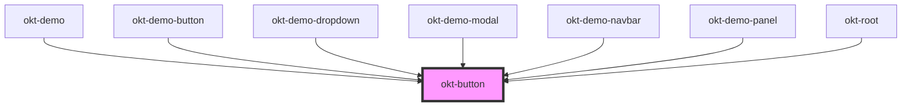

# okt-button

<!-- Auto Generated Below -->

## Properties

| Property    | Attribute    | Description | Type                                                                                                                       | Default     |
| ----------- | ------------ | ----------- | -------------------------------------------------------------------------------------------------------------------------- | ----------- |
| `active`    | `active`     |             | `boolean`                                                                                                                  | `undefined` |
| `color`     | `color`      |             | `"black" \| "danger" \| "dark" \| "info" \| "light" \| "link" \| "primary" \| "success" \| "text" \| "warning" \| "white"` | `undefined` |
| `disabled`  | `disabled`   |             | `boolean`                                                                                                                  | `undefined` |
| `focused`   | `focused`    |             | `boolean`                                                                                                                  | `undefined` |
| `fullWidth` | `full-width` |             | `boolean`                                                                                                                  | `undefined` |
| `hovered`   | `hovered`    |             | `boolean`                                                                                                                  | `undefined` |
| `href`      | `href`       |             | `string`                                                                                                                   | `undefined` |
| `inverted`  | `inverted`   |             | `boolean`                                                                                                                  | `undefined` |
| `light`     | `light`      |             | `boolean`                                                                                                                  | `undefined` |
| `loading`   | `loading`    |             | `boolean`                                                                                                                  | `undefined` |
| `outlined`  | `outlined`   |             | `boolean`                                                                                                                  | `undefined` |
| `rounded`   | `rounded`    |             | `boolean`                                                                                                                  | `undefined` |
| `size`      | `size`       |             | `"large" \| "medium" \| "normal" \| "small"`                                                                               | `undefined` |
| `tag`       | `tag`        |             | `"a" \| "button" \| "input"`                                                                                               | `undefined` |
| `type`      | `type`       |             | `"button" \| "reset" \| "submit"`                                                                                          | `'button'`  |

## Dependencies

### Used by

 - [okt-demo](../demo)
 - [okt-demo-button](../demo-button)
 - [okt-demo-dropdown](../demo-dropdown)
 - [okt-demo-modal](../demo-modal)
 - [okt-demo-navbar](../demo-navbar)
 - [okt-demo-panel](../demo-panel)
 - [okt-root](../root)

### Graph

----------------------------------------------

*Built with [StencilJS](https://stenciljs.com/)*
