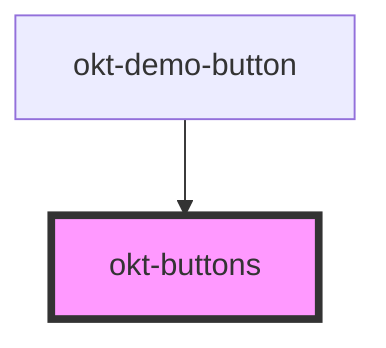

# okt-buttons

<!-- Auto Generated Below -->

## Properties

| Property    | Attribute   | Description | Type                                         | Default     |
| ----------- | ----------- | ----------- | -------------------------------------------- | ----------- |
| `addons`    | `addons`    |             | `boolean`                                    | `undefined` |
| `alignment` | `alignment` |             | `"centered" \| "right"`                      | `undefined` |
| `size`      | `size`      |             | `"large" \| "medium" \| "normal" \| "small"` | `undefined` |

## Dependencies

### Used by

 - [okt-demo-button](../demo-button)

### Graph

----------------------------------------------

*Built with [StencilJS](https://stenciljs.com/)*
