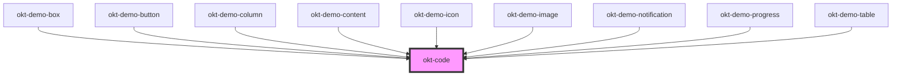

# okt-code

<!-- Auto Generated Below -->

## Dependencies

### Used by

 - [okt-demo-box](../demo-box)
 - [okt-demo-button](../demo-button)
 - [okt-demo-column](../demo-column)
 - [okt-demo-content](../demo-content)
 - [okt-demo-icon](../demo-icon)
 - [okt-demo-image](../demo-image)
 - [okt-demo-notification](../demo-notification)
 - [okt-demo-progress](../demo-progress)
 - [okt-demo-table](../demo-table)

### Graph

----------------------------------------------

*Built with [StencilJS](https://stenciljs.com/)*
