# okt-code

<!-- Auto Generated Below -->

## Dependencies

### Used by

 - [okt-demo-box](../demo-box)
 - [okt-demo-breadcrumb](../demo-breadcrumb)
 - [okt-demo-button](../demo-button)
 - [okt-demo-card](../demo-card)
 - [okt-demo-column](../demo-column)
 - [okt-demo-content](../demo-content)
 - [okt-demo-dropdown](../demo-dropdown)
 - [okt-demo-icon](../demo-icon)
 - [okt-demo-image](../demo-image)
 - [okt-demo-menu](../demo-menu)
 - [okt-demo-message](../demo-message)
 - [okt-demo-notification](../demo-notification)
 - [okt-demo-progress](../demo-progress)
 - [okt-demo-table](../demo-table)
 - [okt-demo-tag](../demo-tag)

### Graph

```mermaid
graph TD;
  okt-demo-box --> okt-code
  okt-demo-breadcrumb --> okt-code
  okt-demo-button --> okt-code
  okt-demo-card --> okt-code
  okt-demo-column --> okt-code
  okt-demo-content --> okt-code
  okt-demo-dropdown --> okt-code
  okt-demo-icon --> okt-code
  okt-demo-image --> okt-code
  okt-demo-menu --> okt-code
  okt-demo-message --> okt-code
  okt-demo-notification --> okt-code
  okt-demo-progress --> okt-code
  okt-demo-table --> okt-code
  okt-demo-tag --> okt-code
  style okt-code fill:#f9f,stroke:#333,stroke-width:4px
```

----------------------------------------------

*Built with [StencilJS](https://stenciljs.com/)*
