# okt-column

<!-- Auto Generated Below -->

## Properties

| Property           | Attribute           | Description | Type                                                                                                                                                               | Default     |
| ------------------ | ------------------- | ----------- | ------------------------------------------------------------------------------------------------------------------------------------------------------------------ | ----------- |
| `columns`          | `columns`           |             | `"four-fifths" \| "full" \| "half" \| "one-fifth" \| "one-quarter" \| "one-third" \| "three-fifths" \| "three-quarters" \| "two-fifths" \| "two-thirds" \| number` | `undefined` |
| `desktop`          | `desktop`           |             | `"four-fifths" \| "full" \| "half" \| "one-fifth" \| "one-quarter" \| "one-third" \| "three-fifths" \| "three-quarters" \| "two-fifths" \| "two-thirds" \| number` | `undefined` |
| `fullhd`           | `fullhd`            |             | `"four-fifths" \| "full" \| "half" \| "one-fifth" \| "one-quarter" \| "one-third" \| "three-fifths" \| "three-quarters" \| "two-fifths" \| "two-thirds" \| number` | `undefined` |
| `mobile`           | `mobile`            |             | `"four-fifths" \| "full" \| "half" \| "one-fifth" \| "one-quarter" \| "one-third" \| "three-fifths" \| "three-quarters" \| "two-fifths" \| "two-thirds" \| number` | `undefined` |
| `narrow`           | `narrow`            |             | `"desktop" \| "fullhd" \| "mobile" \| "tablet" \| "touch" \| "widescreen" \| boolean`                                                                              | `undefined` |
| `offset`           | `offset`            |             | `"four-fifths" \| "full" \| "half" \| "one-fifth" \| "one-quarter" \| "one-third" \| "three-fifths" \| "three-quarters" \| "two-fifths" \| "two-thirds" \| number` | `undefined` |
| `offsetDesktop`    | `offset-desktop`    |             | `"four-fifths" \| "full" \| "half" \| "one-fifth" \| "one-quarter" \| "one-third" \| "three-fifths" \| "three-quarters" \| "two-fifths" \| "two-thirds" \| number` | `undefined` |
| `offsetFullhd`     | `offset-fullhd`     |             | `"four-fifths" \| "full" \| "half" \| "one-fifth" \| "one-quarter" \| "one-third" \| "three-fifths" \| "three-quarters" \| "two-fifths" \| "two-thirds" \| number` | `undefined` |
| `offsetMobile`     | `offset-mobile`     |             | `"four-fifths" \| "full" \| "half" \| "one-fifth" \| "one-quarter" \| "one-third" \| "three-fifths" \| "three-quarters" \| "two-fifths" \| "two-thirds" \| number` | `undefined` |
| `offsetTablet`     | `offset-tablet`     |             | `"four-fifths" \| "full" \| "half" \| "one-fifth" \| "one-quarter" \| "one-third" \| "three-fifths" \| "three-quarters" \| "two-fifths" \| "two-thirds" \| number` | `undefined` |
| `offsetTouch`      | `offset-touch`      |             | `"four-fifths" \| "full" \| "half" \| "one-fifth" \| "one-quarter" \| "one-third" \| "three-fifths" \| "three-quarters" \| "two-fifths" \| "two-thirds" \| number` | `undefined` |
| `offsetWidescreen` | `offset-widescreen` |             | `"four-fifths" \| "full" \| "half" \| "one-fifth" \| "one-quarter" \| "one-third" \| "three-fifths" \| "three-quarters" \| "two-fifths" \| "two-thirds" \| number` | `undefined` |
| `tablet`           | `tablet`            |             | `"four-fifths" \| "full" \| "half" \| "one-fifth" \| "one-quarter" \| "one-third" \| "three-fifths" \| "three-quarters" \| "two-fifths" \| "two-thirds" \| number` | `undefined` |
| `touch`            | `touch`             |             | `"four-fifths" \| "full" \| "half" \| "one-fifth" \| "one-quarter" \| "one-third" \| "three-fifths" \| "three-quarters" \| "two-fifths" \| "two-thirds" \| number` | `undefined` |
| `widescreen`       | `widescreen`        |             | `"four-fifths" \| "full" \| "half" \| "one-fifth" \| "one-quarter" \| "one-third" \| "three-fifths" \| "three-quarters" \| "two-fifths" \| "two-thirds" \| number` | `undefined` |

## Dependencies

### Used by

 - [okt-demo](../demo)
 - [okt-demo-box](../demo-box)
 - [okt-demo-breadcrumb](../demo-breadcrumb)
 - [okt-demo-button](../demo-button)
 - [okt-demo-card](../demo-card)
 - [okt-demo-column](../demo-column)
 - [okt-demo-container](../demo-container)
 - [okt-demo-content](../demo-content)
 - [okt-demo-dropdown](../demo-dropdown)
 - [okt-demo-icon](../demo-icon)
 - [okt-demo-image](../demo-image)
 - [okt-demo-menu](../demo-menu)
 - [okt-demo-message](../demo-message)
 - [okt-demo-modal](../demo-modal)
 - [okt-demo-navbar](../demo-navbar)
 - [okt-demo-notification](../demo-notification)
 - [okt-demo-pagination](../demo-pagination)
 - [okt-demo-progress](../demo-progress)
 - [okt-demo-table](../demo-table)
 - [okt-demo-tag](../demo-tag)
 - [okt-root](../root)

### Graph

```mermaid
graph TD;
  okt-demo --> okt-column
  okt-demo-box --> okt-column
  okt-demo-breadcrumb --> okt-column
  okt-demo-button --> okt-column
  okt-demo-card --> okt-column
  okt-demo-column --> okt-column
  okt-demo-container --> okt-column
  okt-demo-content --> okt-column
  okt-demo-dropdown --> okt-column
  okt-demo-icon --> okt-column
  okt-demo-image --> okt-column
  okt-demo-menu --> okt-column
  okt-demo-message --> okt-column
  okt-demo-modal --> okt-column
  okt-demo-navbar --> okt-column
  okt-demo-notification --> okt-column
  okt-demo-pagination --> okt-column
  okt-demo-progress --> okt-column
  okt-demo-table --> okt-column
  okt-demo-tag --> okt-column
  okt-root --> okt-column
  style okt-column fill:#f9f,stroke:#333,stroke-width:4px
```

----------------------------------------------

*Built with [StencilJS](https://stenciljs.com/)*
