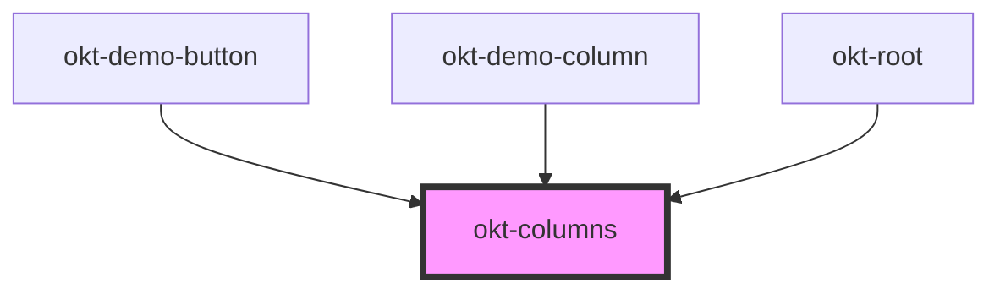

# okt-columns

<!-- Auto Generated Below -->

## Properties

| Property        | Attribute        | Description | Type                                                                       | Default     |
| --------------- | ---------------- | ----------- | -------------------------------------------------------------------------- | ----------- |
| `centered`      | `centered`       |             | `boolean`                                                                  | `undefined` |
| `gap`           | `gap`            |             | `number`                                                                   | `undefined` |
| `gapDesktop`    | `gap-desktop`    |             | `number`                                                                   | `undefined` |
| `gapFullhd`     | `gap-fullhd`     |             | `number`                                                                   | `undefined` |
| `gapMobile`     | `gap-mobile`     |             | `number`                                                                   | `undefined` |
| `gapTablet`     | `gap-tablet`     |             | `number`                                                                   | `undefined` |
| `gapWidescreen` | `gap-widescreen` |             | `number`                                                                   | `undefined` |
| `gapless`       | `gapless`        |             | `boolean`                                                                  | `undefined` |
| `multiline`     | `multiline`      |             | `boolean`                                                                  | `undefined` |
| `stage`         | `stage`          |             | `"desktop" \| "fullhd" \| "mobile" \| "tablet" \| "touch" \| "widescreen"` | `undefined` |
| `variable`      | `variable`       |             | `boolean`                                                                  | `undefined` |
| `vcentered`     | `vcentered`      |             | `boolean`                                                                  | `undefined` |

## Dependencies

### Used by

 - [okt-demo-button](../demo-button)
 - [okt-demo-column](../demo-column)
 - [okt-root](../root)

### Graph

----------------------------------------------

*Built with [StencilJS](https://stenciljs.com/)*
