# okt-columns

<!-- Auto Generated Below -->

## Properties

| Property        | Attribute        | Description | Type                                                                       | Default     |
| --------------- | ---------------- | ----------- | -------------------------------------------------------------------------- | ----------- |
| `centered`      | `centered`       |             | `boolean`                                                                  | `undefined` |
| `gap`           | `gap`            |             | `number`                                                                   | `undefined` |
| `gapDesktop`    | `gap-desktop`    |             | `number`                                                                   | `undefined` |
| `gapFullhd`     | `gap-fullhd`     |             | `number`                                                                   | `undefined` |
| `gapMobile`     | `gap-mobile`     |             | `number`                                                                   | `undefined` |
| `gapTablet`     | `gap-tablet`     |             | `number`                                                                   | `undefined` |
| `gapWidescreen` | `gap-widescreen` |             | `number`                                                                   | `undefined` |
| `gapless`       | `gapless`        |             | `boolean`                                                                  | `undefined` |
| `multiline`     | `multiline`      |             | `boolean`                                                                  | `undefined` |
| `stage`         | `stage`          |             | `"desktop" \| "fullhd" \| "mobile" \| "tablet" \| "touch" \| "widescreen"` | `undefined` |
| `variable`      | `variable`       |             | `boolean`                                                                  | `undefined` |
| `vcentered`     | `vcentered`      |             | `boolean`                                                                  | `undefined` |

## Dependencies

### Used by

 - [okt-demo](../demo)
 - [okt-demo-box](../demo-box)
 - [okt-demo-breadcrumb](../demo-breadcrumb)
 - [okt-demo-button](../demo-button)
 - [okt-demo-card](../demo-card)
 - [okt-demo-column](../demo-column)
 - [okt-demo-container](../demo-container)
 - [okt-demo-content](../demo-content)
 - [okt-demo-dropdown](../demo-dropdown)
 - [okt-demo-icon](../demo-icon)
 - [okt-demo-image](../demo-image)
 - [okt-demo-menu](../demo-menu)
 - [okt-demo-message](../demo-message)
 - [okt-demo-modal](../demo-modal)
 - [okt-demo-navbar](../demo-navbar)
 - [okt-demo-notification](../demo-notification)
 - [okt-demo-pagination](../demo-pagination)
 - [okt-demo-panel](../demo-panel)
 - [okt-demo-progress](../demo-progress)
 - [okt-demo-table](../demo-table)
 - [okt-demo-tag](../demo-tag)
 - [okt-root](../root)

### Graph

```mermaid
graph TD;
  okt-demo --> okt-columns
  okt-demo-box --> okt-columns
  okt-demo-breadcrumb --> okt-columns
  okt-demo-button --> okt-columns
  okt-demo-card --> okt-columns
  okt-demo-column --> okt-columns
  okt-demo-container --> okt-columns
  okt-demo-content --> okt-columns
  okt-demo-dropdown --> okt-columns
  okt-demo-icon --> okt-columns
  okt-demo-image --> okt-columns
  okt-demo-menu --> okt-columns
  okt-demo-message --> okt-columns
  okt-demo-modal --> okt-columns
  okt-demo-navbar --> okt-columns
  okt-demo-notification --> okt-columns
  okt-demo-pagination --> okt-columns
  okt-demo-panel --> okt-columns
  okt-demo-progress --> okt-columns
  okt-demo-table --> okt-columns
  okt-demo-tag --> okt-columns
  okt-root --> okt-columns
  style okt-columns fill:#f9f,stroke:#333,stroke-width:4px
```

----------------------------------------------

*Built with [StencilJS](https://stenciljs.com/)*
