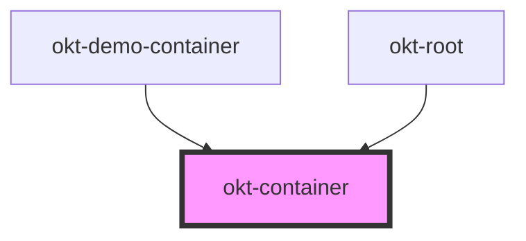

# okt-container

<!-- Auto Generated Below -->

## Properties

| Property     | Attribute    | Description | Type                       | Default     |
| ------------ | ------------ | ----------- | -------------------------- | ----------- |
| `breakpoint` | `breakpoint` |             | `"fullhd" \| "widescreen"` | `undefined` |
| `fluid`      | `fluid`      |             | `boolean`                  | `undefined` |

## Dependencies

### Used by

 - [okt-demo-container](../demo-container)
 - [okt-root](../root)

### Graph

----------------------------------------------

*Built with [StencilJS](https://stenciljs.com/)*
