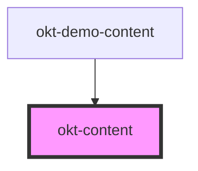

# okt-content

<!-- Auto Generated Below -->

## Properties

| Property | Attribute | Description | Type                                         | Default     |
| -------- | --------- | ----------- | -------------------------------------------- | ----------- |
| `size`   | `size`    |             | `"large" \| "medium" \| "normal" \| "small"` | `undefined` |

## Dependencies

### Used by

 - [okt-demo-content](../demo-content)

### Graph

----------------------------------------------

*Built with [StencilJS](https://stenciljs.com/)*
