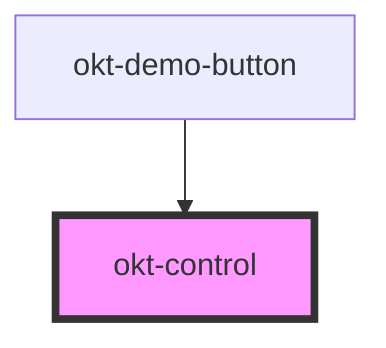

# okt-control

<!-- Auto Generated Below -->

## Properties

| Property    | Attribute    | Description | Type      | Default     |
| ----------- | ------------ | ----------- | --------- | ----------- |
| `expanded`  | `expanded`   |             | `boolean` | `undefined` |
| `iconLeft`  | `icon-left`  |             | `boolean` | `undefined` |
| `iconRight` | `icon-right` |             | `boolean` | `undefined` |

## Dependencies

### Used by

 - [okt-demo-button](../demo-button)

### Graph

----------------------------------------------

*Built with [StencilJS](https://stenciljs.com/)*
