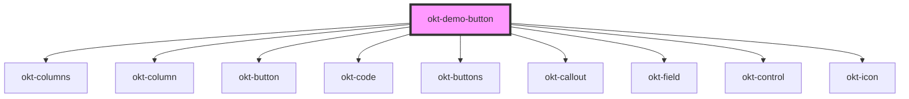

# okt-demo-button

<!-- Auto Generated Below -->

## Dependencies

### Depends on

- [okt-columns](../columns)
- [okt-column](../column)
- [okt-button](../button)
- [okt-code](../code)
- [okt-buttons](../buttons)
- [okt-callout](../callout)
- [okt-field](../field)
- [okt-control](../control)
- [okt-icon](../icon)

### Graph

----------------------------------------------

*Built with [StencilJS](https://stenciljs.com/)*
