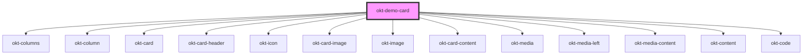

# okt-demo-card

<!-- Auto Generated Below -->

## Dependencies

### Depends on

- [okt-columns](../columns)
- [okt-column](../column)
- [okt-card](../card)
- [okt-card-header](../card-header)
- [okt-icon](../icon)
- [okt-card-image](../card-image)
- [okt-image](../image)
- [okt-card-content](../card-content)
- [okt-media](../media)
- [okt-media-left](../media-left)
- [okt-media-content](../media-content)
- [okt-content](../content)
- [okt-code](../code)

### Graph

----------------------------------------------

*Built with [StencilJS](https://stenciljs.com/)*
