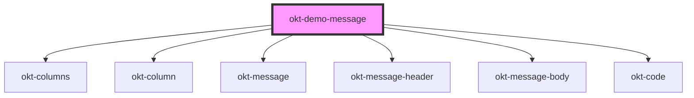

# okt-demo-message

<!-- Auto Generated Below -->

## Dependencies

### Depends on

- [okt-columns](../columns)
- [okt-column](../column)
- [okt-message](../message)
- [okt-message-header](../message-header)
- [okt-message-body](../message-body)
- [okt-code](../code)

### Graph

----------------------------------------------

*Built with [StencilJS](https://stenciljs.com/)*
