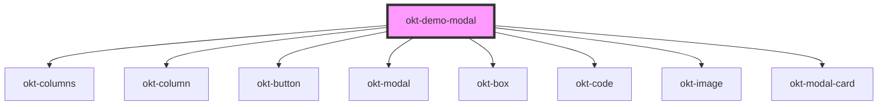

# okt-demo-modal

<!-- Auto Generated Below -->

## Dependencies

### Depends on

- [okt-columns](../columns)
- [okt-column](../column)
- [okt-button](../button)
- [okt-modal](../modal)
- [okt-box](../box)
- [okt-code](../code)
- [okt-image](../image)
- [okt-modal-card](../modal-card)

### Graph

----------------------------------------------

*Built with [StencilJS](https://stenciljs.com/)*
