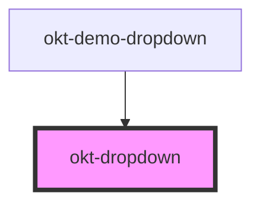

# okt-dropdown

<!-- Auto Generated Below -->

## Properties

| Property    | Attribute   | Description | Type      | Default     |
| ----------- | ----------- | ----------- | --------- | ----------- |
| `active`    | `active`    |             | `boolean` | `undefined` |
| `hoverable` | `hoverable` |             | `boolean` | `undefined` |
| `right`     | `right`     |             | `boolean` | `undefined` |
| `up`        | `up`        |             | `boolean` | `undefined` |

## Dependencies

### Used by

 - [okt-demo-dropdown](../demo-dropdown)

### Graph

----------------------------------------------

*Built with [StencilJS](https://stenciljs.com/)*
