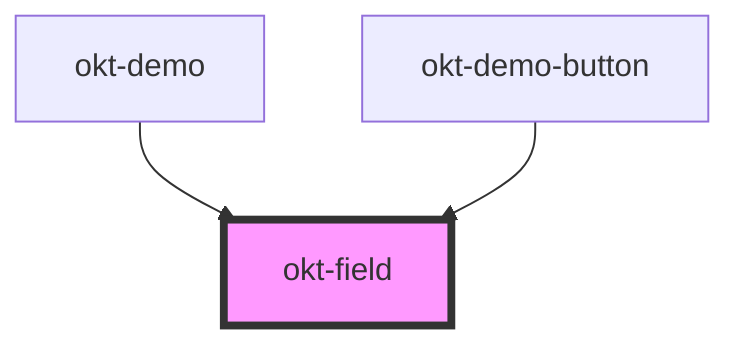

# okt-field

<!-- Auto Generated Below -->

## Properties

| Property           | Attribute           | Description | Type                    | Default     |
| ------------------ | ------------------- | ----------- | ----------------------- | ----------- |
| `addons`           | `addons`            |             | `boolean`               | `undefined` |
| `addonsAlignment`  | `addons-alignment`  |             | `"centered" \| "right"` | `undefined` |
| `groupAlignment`   | `group-alignment`   |             | `"centered" \| "right"` | `undefined` |
| `grouped`          | `grouped`           |             | `boolean`               | `undefined` |
| `groupedMultiline` | `grouped-multiline` |             | `boolean`               | `undefined` |
| `horizontal`       | `horizontal`        |             | `boolean`               | `undefined` |

## Dependencies

### Used by

 - [okt-demo](../demo)
 - [okt-demo-button](../demo-button)

### Graph

----------------------------------------------

*Built with [StencilJS](https://stenciljs.com/)*
