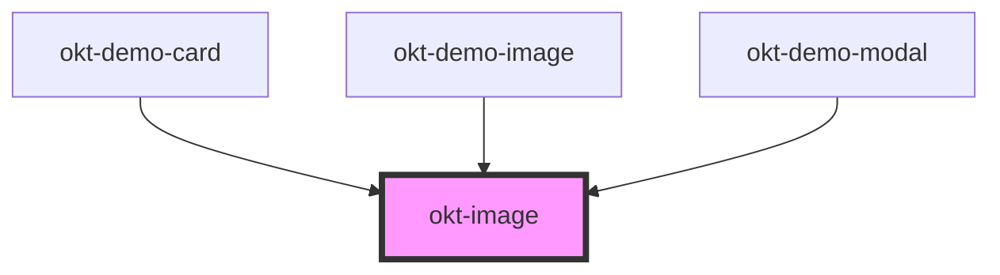

# okt-image

<!-- Auto Generated Below -->

## Properties

| Property    | Attribute    | Description | Type                                                                                                                                                                                                          | Default     |
| ----------- | ------------ | ----------- | ------------------------------------------------------------------------------------------------------------------------------------------------------------------------------------------------------------- | ----------- |
| `alt`       | `alt`        |             | `string`                                                                                                                                                                                                      | `undefined` |
| `hideImage` | `hide-image` |             | `boolean`                                                                                                                                                                                                     | `undefined` |
| `rounded`   | `rounded`    |             | `boolean`                                                                                                                                                                                                     | `undefined` |
| `size`      | `size`       |             | `16 \| 24 \| 32 \| 48 \| 64 \| 96 \| 128 \| "square" \| "1by1" \| "5by4" \| "4by3" \| "3by2" \| "5by3" \| "16by9" \| "2by1" \| "3by1" \| "4by5" \| "3by4" \| "2by3" \| "3by5" \| "9by16" \| "1by2" \| "1by3"` | `undefined` |
| `src`       | `src`        |             | `string`                                                                                                                                                                                                      | `undefined` |

## Dependencies

### Used by

 - [okt-demo-card](../demo-card)
 - [okt-demo-image](../demo-image)
 - [okt-demo-modal](../demo-modal)

### Graph

----------------------------------------------

*Built with [StencilJS](https://stenciljs.com/)*
