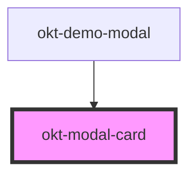

# okt-modal-card

<!-- Auto Generated Below -->

## Properties

| Property          | Attribute           | Description | Type      | Default     |
| ----------------- | ------------------- | ----------- | --------- | ----------- |
| `hideCloseButton` | `hide-close-button` |             | `boolean` | `undefined` |

## Events

| Event           | Description | Type               |
| --------------- | ----------- | ------------------ |
| `content-close` |             | `CustomEvent<any>` |

## Dependencies

### Used by

 - [okt-demo-modal](../demo-modal)

### Graph

----------------------------------------------

*Built with [StencilJS](https://stenciljs.com/)*
