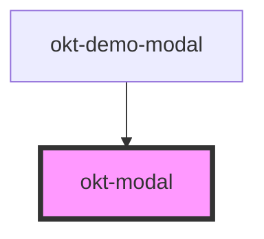

# okt-modal

<!-- Auto Generated Below -->

## Properties

| Property                 | Attribute                  | Description | Type      | Default     |
| ------------------------ | -------------------------- | ----------- | --------- | ----------- |
| `active`                 | `active`                   |             | `any`     | `undefined` |
| `disableBackgroundClose` | `disable-background-close` |             | `boolean` | `undefined` |
| `hideCloseButton`        | `hide-close-button`        |             | `boolean` | `undefined` |

## Events

| Event   | Description | Type               |
| ------- | ----------- | ------------------ |
| `close` |             | `CustomEvent<any>` |

## Dependencies

### Used by

 - [okt-demo-modal](../demo-modal)

### Graph

----------------------------------------------

*Built with [StencilJS](https://stenciljs.com/)*
