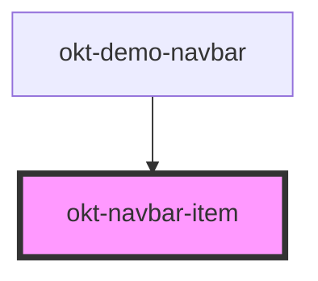

# okt-navbar-item

<!-- Auto Generated Below -->

## Properties

| Property    | Attribute   | Description | Type      | Default     |
| ----------- | ----------- | ----------- | --------- | ----------- |
| `dropdown`  | `dropdown`  |             | `boolean` | `undefined` |
| `hoverable` | `hoverable` |             | `boolean` | `undefined` |

## Dependencies

### Used by

 - [okt-demo-navbar](../demo-navbar)

### Graph

----------------------------------------------

*Built with [StencilJS](https://stenciljs.com/)*
