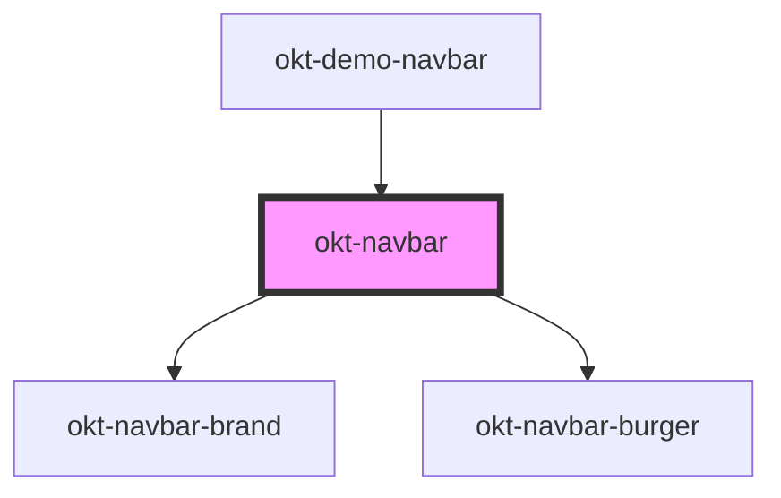

# okt-navbar

<!-- Auto Generated Below -->

## Properties

| Property      | Attribute     | Description | Type                                                                                                             | Default     |
| ------------- | ------------- | ----------- | ---------------------------------------------------------------------------------------------------------------- | ----------- |
| `color`       | `color`       |             | `"black" \| "danger" \| "dark" \| "info" \| "light" \| "link" \| "primary" \| "success" \| "warning" \| "white"` | `undefined` |
| `fixed`       | `fixed`       |             | `"bottom" \| "top"`                                                                                              | `undefined` |
| `hideBurger`  | `hide-burger` |             | `boolean`                                                                                                        | `false`     |
| `spaced`      | `spaced`      |             | `boolean`                                                                                                        | `false`     |
| `transparent` | `transparent` |             | `boolean`                                                                                                        | `false`     |

## Dependencies

### Used by

 - [okt-demo-navbar](../demo-navbar)

### Depends on

- [okt-navbar-brand](../navbar-brand)
- [okt-navbar-burger](../navbar-burger)

### Graph

----------------------------------------------

*Built with [StencilJS](https://stenciljs.com/)*
