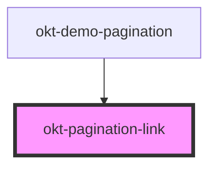

# okt-pagination-link

<!-- Auto Generated Below -->

## Properties

| Property  | Attribute | Description | Type      | Default     |
| --------- | --------- | ----------- | --------- | ----------- |
| `current` | `current` |             | `boolean` | `undefined` |

## Dependencies

### Used by

 - [okt-demo-pagination](../demo-pagination)

### Graph

----------------------------------------------

*Built with [StencilJS](https://stenciljs.com/)*
