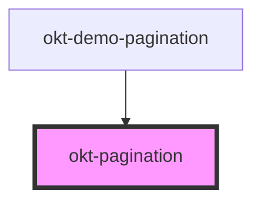

# okt-pagination

<!-- Auto Generated Below -->

## Properties

| Property          | Attribute          | Description | Type                                         | Default     |
| ----------------- | ------------------ | ----------- | -------------------------------------------- | ----------- |
| `alignment`       | `alignment`        |             | `"centered" \| "right"`                      | `undefined` |
| `disableNext`     | `disable-next`     |             | `boolean`                                    | `false`     |
| `disablePrevious` | `disable-previous` |             | `boolean`                                    | `false`     |
| `rounded`         | `rounded`          |             | `boolean`                                    | `false`     |
| `size`            | `size`             |             | `"large" \| "medium" \| "normal" \| "small"` | `undefined` |

## Dependencies

### Used by

 - [okt-demo-pagination](../demo-pagination)

### Graph

----------------------------------------------

*Built with [StencilJS](https://stenciljs.com/)*
