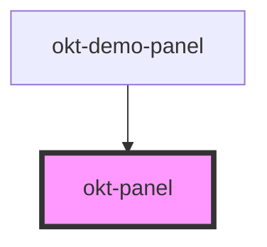

# okt-panel

<!-- Auto Generated Below -->

## Properties

| Property | Attribute | Description | Type                                                                                                             | Default     |
| -------- | --------- | ----------- | ---------------------------------------------------------------------------------------------------------------- | ----------- |
| `color`  | `color`   |             | `"black" \| "danger" \| "dark" \| "info" \| "light" \| "link" \| "primary" \| "success" \| "warning" \| "white"` | `undefined` |

## Dependencies

### Used by

 - [okt-demo-panel](../demo-panel)

### Graph

----------------------------------------------

*Built with [StencilJS](https://stenciljs.com/)*
