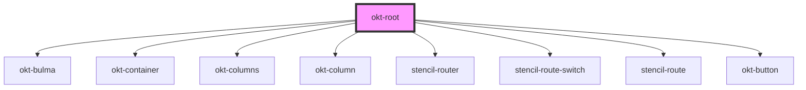

# okt-root

<!-- Auto Generated Below -->

## Dependencies

### Depends on

- [okt-bulma](../bulma)
- [okt-container](../container)
- [okt-columns](../columns)
- [okt-column](../column)
- stencil-router
- stencil-route-switch
- stencil-route
- [okt-button](../button)

### Graph

----------------------------------------------

*Built with [StencilJS](https://stenciljs.com/)*
