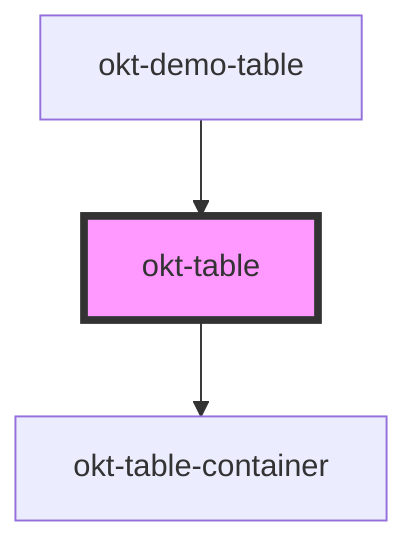

# okt-table

<!-- Auto Generated Below -->

## Properties

| Property     | Attribute    | Description | Type      | Default     |
| ------------ | ------------ | ----------- | --------- | ----------- |
| `bordered`   | `bordered`   |             | `boolean` | `undefined` |
| `fullWidth`  | `full-width` |             | `boolean` | `undefined` |
| `hoverable`  | `hoverable`  |             | `boolean` | `undefined` |
| `narrow`     | `narrow`     |             | `boolean` | `undefined` |
| `scrollable` | `scrollable` |             | `boolean` | `undefined` |
| `striped`    | `striped`    |             | `boolean` | `undefined` |

## Dependencies

### Used by

 - [okt-demo-table](../demo-table)

### Depends on

- [okt-table-container](../table-container)

### Graph

----------------------------------------------

*Built with [StencilJS](https://stenciljs.com/)*
