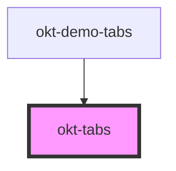

# okt-tabs

<!-- Auto Generated Below -->

## Properties

| Property        | Attribute        | Description | Type                                         | Default     |
| --------------- | ---------------- | ----------- | -------------------------------------------- | ----------- |
| `alignment`     | `alignment`      |             | `"centered" \| "right"`                      | `undefined` |
| `boxed`         | `boxed`          |             | `boolean`                                    | `false`     |
| `fullWidth`     | `full-width`     |             | `boolean`                                    | `false`     |
| `size`          | `size`           |             | `"large" \| "medium" \| "normal" \| "small"` | `undefined` |
| `toggle`        | `toggle`         |             | `boolean`                                    | `false`     |
| `toggleRounded` | `toggle-rounded` |             | `boolean`                                    | `false`     |

## Dependencies

### Used by

 - [okt-demo-tabs](../demo-tabs)

### Graph

----------------------------------------------

*Built with [StencilJS](https://stenciljs.com/)*
